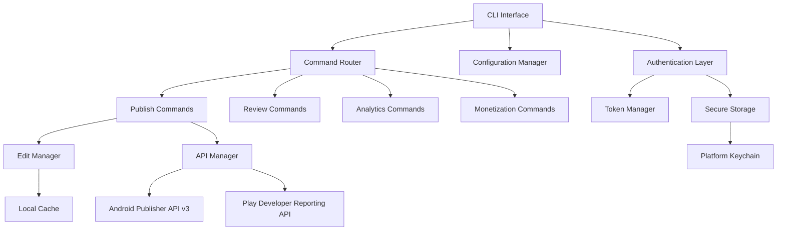

# Design Document

## Overview

The Google Play Developer CLI (gpd) is a fast, lightweight command-line interface that provides programmatic access to Google Play Developer Console functionality. Built in Go for cross-platform compatibility and fast startup times, gpd serves as the Google Play equivalent to the App Store Connect CLI, optimized for developers, CI/CD systems, and AI agents.

### Key Design Principles

- **AI-Agent Friendly**: JSON-first output, explicit flags, predictable exit codes
- **Fast and Lightweight**: Sub-200ms cold start, minimal memory usage
- **Secure by Default**: Platform-specific credential storage, comprehensive PII redaction
- **Atomic Operations**: Edit-based transactions ensure consistency
- **Comprehensive Coverage**: Full API surface mapping across publishing, analytics, and monetization

## Architecture

### High-Level Architecture



### Command Namespace Architecture

The CLI organizes functionality into clear namespaces that map directly to Google Play APIs:

- **publish/\***: App publishing, releases, assets, testing (Android Publisher API v3 - Edits)
- **reviews/\***: User review management and responses (Android Publisher API v3 - Reviews)
- **vitals/\***: Crash rates, ANR rates, performance metrics (Play Developer Reporting API)
- **analytics/\***: Install statistics, ratings data (Play Developer Reporting API)
- **monetization/\***: In-app products and subscriptions (Android Publisher API v3 - InAppProducts)
- **purchases/\***: Purchase token verification (Android Publisher API v3 - Purchases)
- **auth/\***: Authentication and credential management
- **config/\***: Configuration and system health

## Components and Interfaces

### Authentication System

#### Service Account Authentication
```go
type AuthManager interface {
    Authenticate(ctx context.Context, keyPath string) (*Credentials, error)
    GetTokenSource(ctx context.Context) (oauth2.TokenSource, error)
    ValidatePermissions(ctx context.Context, scopes []string) error
}

type Credentials struct {
    TokenSource oauth2.TokenSource
    Origin      CredentialOrigin
    KeyPath     string // Only for keyfile origin
    // No ExpiresAt - always consult TokenSource for current token
}

type CredentialOrigin int
const (
    OriginADC CredentialOrigin = iota
    OriginKeyfile
    OriginEnvironment
)
```

#### Secure Storage Interface
```go
type SecureStorage interface {
    Store(key string, value []byte) error
    Retrieve(key string) ([]byte, error)
    Delete(key string) error
    Available() bool
}
```

Platform-specific implementations:
- **macOS**: Keychain Services
- **Linux**: Secret Service API with fallback to no-store mode
- **Windows**: Windows Credential Manager

### Edit Transaction Manager

#### Edit Management
```go
type EditManager interface {
    BeginEdit(ctx context.Context, packageName string) (*Edit, error)
    CommitEdit(ctx context.Context, edit *Edit) error
    AbortEdit(ctx context.Context, edit *Edit) error
    GetEdit(ctx context.Context, handle string) (*Edit, error)
}

type Edit struct {
    Handle      string    // Local name from --edit-id
    ServerID    string    // Actual edit ID from Google
    PackageName string
    CreatedAt   time.Time
    LastUsedAt  time.Time
    State       EditState
}
```

#### Idempotency and Caching
- SHA256-based artifact caching in `{cacheDir}/artifacts/`
- Edit state persistence in `{configDir}/edits/{package}.json`
- Cross-platform file locking using atomic lockfile creation with PID + timestamp
- **Stale lock policy**: Only remove locks if hostname differs AND age > 4 hours, OR same host AND PID not alive
- Lock contention: 30-second timeout with exit code 8 on failure

```go
type LockFile struct {
    PID       int       `json:"pid"`
    Hostname  string    `json:"hostname"`
    CreatedAt time.Time `json:"createdAt"`
    Command   string    `json:"command"`
    Heartbeat time.Time `json:"heartbeat,omitempty"`
}

func AcquireLock(path string, timeout time.Duration) (*LockFile, error) {
    // 1. Create lockfile atomically with PID + timestamp
    // 2. Check for stale locks using conservative policy
    // 3. Only remove if hostname differs + old OR same host + PID dead
    // 4. Wait up to timeout for lock acquisition
}

func IsProcessAlive(pid int) bool {
    // Best-effort PID check (platform-specific)
    // Used for same-host stale lock detection
}
```

#### Token Storage Behavior

**--store-tokens=auto Detection Rules**:
- Store tokens when secure storage is available AND no CI environment detected
- CI detection: `CI=true`, `GITHUB_ACTIONS=true`, `JENKINS_URL` set, `BUILDKITE=true`, `CIRCLECI=true`
- When CI detected: behave as `--store-tokens=never`

**What gets stored with --store-tokens**:
- **auto**: Access tokens + expiry in secure storage (when available and not CI), credential metadata
- **secure**: Always store in secure storage (fail if unavailable)
- **never**: No storage, always re-authenticate

```go
func DetectCIEnvironment() bool {
    ciVars := []string{"CI", "GITHUB_ACTIONS", "JENKINS_URL", "BUILDKITE", "CIRCLECI"}
    for _, env := range ciVars {
        if os.Getenv(env) != "" {
            return true
        }
    }
    return false
}

type EarlyRefreshTokenSource struct {
    base        oauth2.TokenSource
    refreshLeeway time.Duration // Default: 300s
    clockSkew     time.Duration // Default: 30s
}
```

### API Client Architecture

#### Unified API Client
```go
type APIClient interface {
    AndroidPublisher() AndroidPublisherClient
    PlayReporting() PlayReportingClient
    SetCredentials(creds *Credentials)
    SetTimeout(duration time.Duration)
}

type AndroidPublisherClient interface {
    Edits() EditsService
    Reviews() ReviewsService
    InAppProducts() InAppProductsService
    Purchases() PurchasesService
}

type PurchasesService interface {
    VerifyProduct(ctx context.Context, packageName, productId, token string) (*ProductPurchase, error)
    VerifySubscriptionV2(ctx context.Context, packageName, subscriptionId, token string) (*SubscriptionPurchaseV2, error)
    // Legacy method marked deprecated
    VerifySubscription(ctx context.Context, packageName, subscriptionId, token string) (*SubscriptionPurchase, error) // Deprecated
}

type PlayReportingClient interface {
    Analytics() AnalyticsService
    Vitals() VitalsService
}
```

### Command Framework

#### Command Interface
```go
type Command interface {
    Execute(ctx context.Context, args []string) *Result
    Validate(args []string) *Result // Return structured validation errors
    Help() string
}

type Result struct {
    Data     interface{} `json:"data"`
    Error    *APIError   `json:"error"`
    Meta     *Metadata   `json:"meta"`
    ExitCode int         `json:"-"` // Process state only, not in JSON
}

type Metadata struct {
    // Core fields (always present)
    NoOp         bool              `json:"noop"`
    DurationMs   int64             `json:"durationMs"`
    Services     []string          `json:"services"`
    
    // Optional fields
    RequestID     string            `json:"requestId,omitempty"`
    PageToken     string            `json:"pageToken,omitempty"`
    NextPageToken string            `json:"nextPageToken,omitempty"`
    Warnings      []string          `json:"warnings,omitempty"`
    
    // Extended fields for specific operations
    Partial         bool             `json:"partial,omitempty"`         // List operations with limits
    ScannedCount    int              `json:"scannedCount,omitempty"`    // Reviews, analytics
    FilteredCount   int              `json:"filteredCount,omitempty"`   // Client-side filtering
    TotalAvailable  int              `json:"totalAvailable,omitempty"`  // Total items available (if known)
    Retries         int              `json:"retries,omitempty"`         // Retry attempts made
    DataFreshnessUtc *time.Time      `json:"dataFreshnessUtc,omitempty"` // Analytics data age
    NoOpReason      string           `json:"noopReason,omitempty"`      // Why operation was skipped
}
```

**Error Handling Contract**: 
- Internal functions may return Go `error` for network, filesystem, parsing issues
- At command boundary, always return `*Result` with structured errors
- Validation errors are also returned as `*Result` for consistency
- Central error mapping converts Go errors to `Result{Error: ...}`

#### Lazy Initialization Pattern
```go
type CLI struct {
    config    *Config
    apiClient APIClient // Initialized only when needed
    authMgr   AuthManager
}

func (c *CLI) Execute(ctx context.Context, args []string) *Result {
    // 1. Parse args and config first (fast)
    // 2. Build API clients only for invoked command (lazy)
    // 3. Avoid heavy initialization in init()
}
```

### Output Formatting System

#### Output Manager
```go
type OutputManager interface {
    Format(result *Result, format OutputFormat) ([]byte, error)
    SetFields(fields []string)
    SetPretty(pretty bool)
}

type OutputFormat int
const (
    FormatJSON OutputFormat = iota
    FormatTable
    FormatMarkdown
    FormatCSV  // Only for analytics/vitals
)
```

#### JSON Envelope Structure
```json
{
  "data": {},
  "error": null,
  "meta": {
    "noop": false,
    "durationMs": 1250,
    "services": ["androidpublisher"],
    "requestId": "req_123",
    "nextPageToken": "token_456",
    "warnings": []
  }
}
```

**Success Response**: `error` is `null`, `data` contains results
**Failure Response**: `error` contains error details, `data` is `null`

### Publishing Operations

#### Rollback Algorithm
The rollback operation is implemented as a multi-step workflow:

```go
type RollbackPlan struct {
    CurrentRelease *Release `json:"currentRelease"`
    TargetRelease  *Release `json:"targetRelease"`
    Track          string   `json:"track"`
    VersionCode    int64    `json:"versionCode"`
    RollbackType   string   `json:"rollbackType"` // "previous", "specific"
}

func (p *PublishService) PlanRollback(ctx context.Context, track string, versionCode *int64) (*RollbackPlan, error) {
    // 1. Fetch current track state and release history
    // 2. Determine target release (previous or specific version code)
    // 3. Validate rollback is possible
    // 4. Return rollback plan for dry-run or execution
}
```

**Rollback Selection Rules**:
- **Automatic**: Select most recent previous release on the same track
- **Explicit**: Use provided `--version-code` if it exists in track history
- **Ambiguous**: Require explicit `--version-code` when multiple candidates exist

#### Review Operations and Limitations

**Review List API Reality**:
The Android Publisher API `reviews.list` method supports:
- **Server-side**: `translationLanguage` parameter (for translation output, not filtering)
- **Client-side**: All filtering (date range, rating, original language) over returned results

```go
type ReviewFilter struct {
    TranslationLanguage string     `json:"translationLanguage,omitempty"` // Server-side translation
    StartDate          *time.Time `json:"startDate,omitempty"`           // Client-side filter
    EndDate            *time.Time `json:"endDate,omitempty"`             // Client-side filter
    MinRating          int        `json:"minRating,omitempty"`           // Client-side filter
    MaxRating          int        `json:"maxRating,omitempty"`           // Client-side filter
    ScanLimit          int        `json:"scanLimit,omitempty"`           // Default: 100 reviews
}

type ReviewListResult struct {
    Reviews       []*ReviewOutput `json:"reviews"`
    ScannedCount  int            `json:"scannedReviews"`
    FilteredCount int            `json:"filteredOut"`
    Partial       bool           `json:"partial"` // True if scan limit reached
}
```

**Review Reply Constraints**:
- Response length limits enforced at validation time
- Rate limiting with idempotency (same reviewId + text hash = skip)
- Deterministic validation failures for constraint violations

**Scanning Strategy**:
- Default scan limit: 100 reviews to prevent excessive API calls
- Configurable via `--scan-limit` flag
- Stop scanning when limit reached or no more pages available
- Report partial results with metadata

#### Tester Management Limits

Tester limits are configurable guardrails matching requirements:

```go
type TesterLimits struct {
    Internal int `json:"internal" default:"200"` // Matches Requirements 10.5
    Alpha    int `json:"alpha" default:"-1"`     // Unlimited
    Beta     int `json:"beta" default:"-1"`      // Unlimited
}
```

## Data Models

### Publishing Models
```go
type Release struct {
    Name         string            `json:"name"`
    VersionCodes []int64           `json:"versionCodes"`
    Status       ReleaseStatus     `json:"status"`
    UserFraction float64           `json:"userFraction,omitempty"`
    ReleaseNotes []ReleaseNote     `json:"releaseNotes,omitempty"`
}

type ReleaseStatus string
const (
    StatusDraft      ReleaseStatus = "draft"
    StatusCompleted  ReleaseStatus = "completed"
    StatusHalted     ReleaseStatus = "halted"
    StatusInProgress ReleaseStatus = "inProgress"
)

type ReleaseNote struct {
    Language string `json:"language"`
    Text     string `json:"text"`
}
```

#### Asset Management
```go
type Asset struct {
    Type     AssetType `json:"type"`
    Locale   string    `json:"locale"`
    Category string    `json:"category"`
    Path     string    `json:"path"`
    URL      string    `json:"url,omitempty"`
}

type AssetType string
const (
    AssetScreenshot    AssetType = "screenshot"
    AssetFeatureGraphic AssetType = "featureGraphic"
    AssetIcon          AssetType = "icon"
)
```

### Review Models

#### Review and Response
```go
type Review struct {
    ReviewID         string    `json:"reviewId"`
    AuthorName       string    `json:"-"`                    // Never serialized (PII)
    Rating           int       `json:"rating"`
    Text             string    `json:"text,omitempty"`       // Only included with --include-review-text
    Language         string    `json:"language"`
    LastModified     time.Time `json:"lastModified"`
    DeveloperComment *Comment  `json:"developerComment,omitempty"`
}

type Comment struct {
    Text         string    `json:"text"`
    LastModified time.Time `json:"lastModified"`
}
```

### Analytics Models

#### Metrics Data
```go
type MetricsData struct {
    Dimensions []Dimension `json:"dimensions"`
    Metrics    []Metric    `json:"metrics"`
    Rows       []Row       `json:"rows"`
}

type Dimension struct {
    Name string `json:"name"`
    Type string `json:"type"`
}

type Metric struct {
    Name string `json:"name"`
    Type string `json:"type"`
}
```

### Configuration Models

#### Configuration Structure
```go
type Config struct {
    DefaultPackage       string            `json:"defaultPackage,omitempty"`
    ServiceAccountKeyPath string           `json:"serviceAccountKeyPath,omitempty"`
    CredentialOrigin     string            `json:"credentialOrigin,omitempty"` // "adc", "keyfile", "env"
    OutputFormat         string            `json:"outputFormat,omitempty"`
    TimeoutSeconds       int               `json:"timeoutSeconds,omitempty"`
    StoreTokens          string            `json:"storeTokens,omitempty"`
    RateLimits           map[string]string `json:"rateLimits,omitempty"` // operation -> duration (e.g., "reviews.reply": "5s")
    TesterLimits         *TesterLimits     `json:"testerLimits,omitempty"`
}
```

### Security and Privacy

#### Structured Logging and Redaction
```go
type Logger interface {
    Info(msg string, fields ...Field)
    Error(msg string, fields ...Field)
    Debug(msg string, fields ...Field)
}

type Field struct {
    Key   string
    Value interface{}
    PII   bool // Mark as PII for redaction
}

// Allowlisted fields for logging
var AllowedLogFields = map[string]bool{
    "command":     true,
    "duration":    true,
    "exit_code":   true,
    "package":     true,
    "track":       true,
    "version_code": true,
    // PII fields explicitly excluded
    "review_text":  false,
    "author_name":  false,
    "order_id":     false,
    "purchase_token": false,
}

func RedactPII(data interface{}) interface{} {
    // Apply structured redaction transforms by field path
    // Only log allowlisted fields
    // Redact nested PII in complex structures
}
```

#### Review Text Handling
```go
type ReviewListOptions struct {
    IncludeText         bool   `json:"includeText"`         // Default: false
    TranslationLanguage string `json:"translationLanguage,omitempty"`
    ScanLimit          int    `json:"scanLimit"`           // Default: 100
}

type ReviewOutput struct {
    ReviewID         string    `json:"reviewId"`
    Rating           int       `json:"rating"`
    Text             string    `json:"text,omitempty"`       // Only when IncludeText=true
    Language         string    `json:"language"`
    LastModified     time.Time `json:"lastModified"`
    DeveloperComment *Comment  `json:"developerComment,omitempty"`
    // AuthorName never included (PII)
}

func (r *ReviewService) List(ctx context.Context, opts *ReviewListOptions) (*ReviewListResult, error) {
    // Note: Review text is still present in memory during processing
    // Stdout omission does not prevent transient in-memory presence
    // Structured logging will exclude text from logs regardless
}
```

### OAuth Scopes and Permission Mapping

| Command Namespace | Required Scopes | Test Call | Failure Hint |
|-------------------|----------------|-----------|---------------|
| `publish/*` | `https://www.googleapis.com/auth/androidpublisher` | `edits.list` | "Enable Google Play Android Publisher API and grant Publishing permissions" |
| `reviews/*` | `https://www.googleapis.com/auth/androidpublisher` | `reviews.list` | "Grant Reviews management permissions in Play Console" |
| `purchases/*` | `https://www.googleapis.com/auth/androidpublisher` | `purchases.products.get` | "Grant Financial data permissions in Play Console" |
| `analytics/*` | `https://www.googleapis.com/auth/playdeveloperreporting` | `vitals.crashrate.query` | "Enable Play Developer Reporting API" |
| `vitals/*` | `https://www.googleapis.com/auth/playdeveloperreporting` | `vitals.crashrate.query` | "Enable Play Developer Reporting API" |

### Complete Command and Flag Matrix

#### Global Flags (Available on all commands)
- `--package` (string): App package name (required or from config)
- `--output` (json|table|markdown): Output format (default: json)
- `--pretty`: Human-readable JSON formatting
- `--timeout` (duration): Network timeout (default: 30s)
- `--store-tokens` (auto|never|secure): Token storage behavior
- `--fields` (string): JSON field projection (comma-separated paths)
- `--quiet`: Suppress stderr except errors
- `--verbose`: Detailed operation logging

#### Shared List Flags (Available on list commands)
- `--all`: Automatically drain all pages
- `--paginate`: Enable pagination mode
- `--page-size` (int): Items per page (default: 50)
- `--page-token` (string): Continue from specific page
- `--next` (string): Friendly alias for --page-token
- `--sort` (string): Sort field, prefix with - for descending
- `--limit` (int): Client-side result limit

#### Command-Specific Requirements

| Command | Required Flags | Optional Flags | Destructive | Pagination |
|---------|---------------|----------------|-------------|------------|
| `publish upload` | artifact file | `--edit-id` | No | No |
| `publish release` | `--track`, `--version-code` | `--name`, `--status`, `--edit-id` | No | No |
| `publish rollout` | `--track`, `--percentage` | `--edit-id` | No | No |
| `publish promote` | `--from-track`, `--to-track` | `--percentage`, `--edit-id` | No | No |
| `publish halt` | `--track` | `--edit-id` | Yes (`--confirm`) | No |
| `publish rollback` | `--track` | `--version-code`, `--edit-id` | Yes (`--confirm`) | No |
| `reviews list` | None | `--rating`, `--language`, `--scan-limit`, `--include-review-text` | No | Yes |
| `reviews reply` | `reviewId`, `text` | `--template-file`, `--max-actions`, `--rate-limit` | No | No |
| `purchases verify` | `token` | `--environment` | No | No |
| `analytics` | `--start-date`, `--end-date` | `--metrics`, `--dimensions` | No | Yes |
| `vitals` | `--start-date`, `--end-date` | `--metrics` | No | Yes |
| `auth check` | None | None | No | No |
| `config doctor` | None | None | No | No |

#### Flag Precedence Rules
1. Command-line flags (highest priority)
2. Environment variables (`GPD_PACKAGE`, `GPD_TIMEOUT`, etc.)
3. Configuration file values
4. Built-in defaults (lowest priority)

### Permission Validation Strategy
```go
type PermissionCheck struct {
    Surface     string `json:"surface"`     // "edits", "reviews", "purchases", "reporting"
    HasAccess   bool   `json:"hasAccess"`
    Error       string `json:"error,omitempty"`
    TestCall    string `json:"testCall"`    // API call used for validation
}

type AuthCheckResult struct {
    Valid       bool               `json:"valid"`
    Permissions []*PermissionCheck `json:"permissions"`
}

func (a *AuthService) CheckPermissions(ctx context.Context) (*AuthCheckResult, error) {
    checks := []*PermissionCheck{
        {Surface: "edits", TestCall: "edits.list"},
        {Surface: "reviews", TestCall: "reviews.list"},
        {Surface: "purchases", TestCall: "purchases.products.get"},
        {Surface: "reporting", TestCall: "vitals.crashrate.query"},
    }
    
    // Make minimal read-only API calls to validate access
    // Report per-surface success/failure with specific errors
}
```

### Command Contract Reference
|---------|----------------|-----------|-----------------|---------|-------------------|
| `publish upload` | artifact file, --package | AndroidPublisher.Edits | SHA256(file) + package | Yes | None |
| `publish release` | --track, --package | AndroidPublisher.Edits | package + track + versionCodes | Yes | None |
| `reviews list` | --package | AndroidPublisher.Reviews | None | Yes | AuthorName always |
| `reviews reply` | --package, reviewId, text | AndroidPublisher.Reviews | reviewId + text hash | No | AuthorName, review text |
| `purchases verify` | --package, token | AndroidPublisher.Purchases | token + environment | Yes | PurchaseToken in logs |
| `analytics` | --package, date range | PlayReporting | package + date + metrics | Yes | None |
| `auth check` | credentials | Multiple | None | No | Tokens, keys |

### Idempotency Strategy

#### Operation Equivalence Rules
- **Upload**: Same file (SHA256) + same package = idempotent
- **Release**: Same package + track + version codes + release notes = idempotent  
- **Review Reply**: Same review ID + same response text hash = idempotent
- **Tester Management**: Same email list (sorted, deduplicated) = idempotent

#### Remote State Matching
```go
type IdempotencyCheck struct {
    Operation    string      `json:"operation"`
    Key          string      `json:"key"`
    LocalState   interface{} `json:"localState"`
    RemoteState  interface{} `json:"remoteState"`
    Matches      bool        `json:"matches"`
    Action       string      `json:"action"` // "skip", "update", "create"
}

func CheckIdempotency(ctx context.Context, op string, key string, desired interface{}) (*IdempotencyCheck, error) {
    // 1. Fetch current remote state
    // 2. Compare with desired state
    // 3. Return action recommendation
}
```

### Partial Results Semantics

#### List Command Behavior
- **Scan limits**: Default limits prevent excessive API calls
- **Incompleteness signals**: `meta.partial=true` when limits reached
- **Progress metadata**: Include `scannedCount`, `filteredCount`, `totalAvailable`

#### Report Command Behavior  
- **Date range constraints**: API-imposed windows documented in capabilities
- **Data freshness**: Include `meta.dataFreshness` timestamp
- **Availability gaps**: Signal missing data periods in `meta.warnings`

### Capabilities and Limits Discovery
```go
type Capabilities struct {
    ReviewWindow    int      `json:"reviewWindowDays"`    // Typical: 30-90 days
    TesterLimits    *TesterLimits `json:"testerLimits"`
    SupportedTracks []string `json:"supportedTracks"`
    APILimitations  []string `json:"apiLimitations"`
}

func (c *CapabilitiesService) GetReviewCapabilities(ctx context.Context) (*Capabilities, error) {
    return &Capabilities{
        ReviewWindow: 90, // Best-effort estimate
        APILimitations: []string{
            "Date range filtering is client-side only",
            "Review window limited to recent reviews",
            "Server-side filtering limited to language/locale",
        },
    }, nil
}
```

#### Dynamic Limits Configuration
```go
type LimitsConfig struct {
    InternalTesters int `json:"internalTesters" default:"100"`
    AlphaTesters    int `json:"alphaTesters" default:"-1"`    // Unlimited
    BetaTesters     int `json:"betaTesters" default:"-1"`     // Unlimited
}

func (t *TesterService) GetLimits(ctx context.Context) (*LimitsConfig, error) {
    // Return current limits from Play Console or configuration
    // Allows for future limit changes without code updates
}
```

## Error Handling

#### Exit Code Mapping
- **0**: Success
- **1**: General API errors
- **2**: Authentication failures
- **3**: Permission denied
- **4**: Input validation errors
- **5**: Rate limit exceeded (HTTP 429, quota errors)
- **6**: Network errors (DNS, TLS, timeouts)
- **7**: Resource not found
- **8**: Conflicts (edit already exists, file lock contention)

#### Error Response Structure
```go
type APIError struct {
    Code             string      `json:"code"`
    Message          string      `json:"message"`
    Hint             string      `json:"hint,omitempty"`
    Details          interface{} `json:"details,omitempty"`
    HTTPStatus       int         `json:"httpStatus,omitempty"`
    RetryAfterSeconds int        `json:"retryAfterSeconds,omitempty"`
    Service          string      `json:"service"`
    Operation        string      `json:"operation"`
}
```

### Retry and Resilience

#### Retry Strategy
- **Exponential backoff**: Base delay 1s, max delay 30s, max retries 3
- **Retryable errors**: 5xx responses, network timeouts, rate limits
- **Non-retryable errors**: 4xx client errors (except 429), authentication failures
- **Retry metadata**: Include `meta.retries` count in response

## Testing Strategy

### Dual Testing Approach

The testing strategy combines unit tests for specific scenarios with property-based tests for comprehensive coverage:

#### Unit Testing
- **Specific examples**: Concrete test cases for known scenarios
- **Edge cases**: Boundary conditions and error states
- **Integration points**: Component interaction testing
- **Mock-based**: Isolated testing with API mocks

#### Property-Based Testing
- **Universal properties**: Rules that must hold for all valid inputs
- **Randomized inputs**: Comprehensive input space coverage
- **Invariant validation**: System properties that never change
- **Round-trip testing**: Serialization/deserialization consistency

### Property-Based Testing Configuration

Using **Testify** with **gopter** for property-based testing:
- **Minimum iterations**: 100 per property test
- **Test tagging**: Each test references design document property
- **Tag format**: `Feature: google-play-cli, Property {number}: {description}`

### Testing Framework Integration

```go
// Example property-based test structure
func TestPublishUploadRoundTrip(t *testing.T) {
    // Feature: google-play-cli, Property 1: Upload artifacts are discoverable
    properties := gopter.NewProperties(nil)
    properties.Property("uploaded artifacts can be discovered", 
        prop.ForAll(testUploadDiscovery, genValidAPK()))
    properties.TestingRun(t)
}
```

Now I need to use the prework tool to analyze the acceptance criteria before writing the correctness properties section:

<function_calls>
<invoke name="prework">
<parameter name="featureName">google-play-cli
## Correctness Properties

*A property is a characteristic or behavior that should hold true across all valid executions of a system—essentially, a formal statement about what the system should do. Properties serve as the bridge between human-readable specifications and machine-verifiable correctness guarantees.*

### Requirements to Properties Mapping

The following properties ensure the correctness of the Google Play CLI across all valid inputs and scenarios. Each property is derived from specific requirements and will be validated through property-based testing.

### Property 1: Command Namespace Organization
*For any* command in the CLI, it should belong to exactly one of the defined namespaces (publish, reviews, vitals, analytics, monetization, purchases, auth, config)
**Validates: Requirements 1.5**

### Property 2: Service Account Permission Validation
*For any* operation requiring API access, the CLI should validate service account permissions before attempting the operation
**Validates: Requirements 1.6**

### Property 3: Auto-Edit Mode Consistency
*For any* publishing operation, when no explicit --edit-id is provided, the CLI should automatically create and commit edit transactions
**Validates: Requirements 2.1**

### Property 4: Edit ID Flag Support
*For any* valid edit ID string, the --edit-id flag should be accepted and used for explicit edit management
**Validates: Requirements 2.2**

### Property 5: Edit Mapping Persistence
*For any* explicit edit ID, the CLI should persist the edit mapping to the filesystem with proper file locking
**Validates: Requirements 2.3**

### Property 6: Concurrent Edit Protection
*For any* edit ID being used by concurrent processes, the CLI should prevent concurrent writes through file locking mechanisms
**Validates: Requirements 2.4**

### Property 7: SHA256 Cache Consistency
*For any* artifact upload operation, the CLI should maintain SHA256 cache entries with 24-hour TTL for idempotency
**Validates: Requirements 2.5**

### Property 8: Idempotent Operation Detection
*For any* duplicate operation detected through caching, the CLI should no-op successfully and return meta.noop=true with a reason
**Validates: Requirements 2.6**

### Property 9: Service Account Authentication
*For any* valid service account JSON key, the CLI should successfully mint short-lived access tokens using OAuth 2.0
**Validates: Requirements 3.1**

### Property 10: Credential Discovery Support
*For any* environment with ADC or GOOGLE_APPLICATION_CREDENTIALS set, the CLI should discover and use those credentials
**Validates: Requirements 3.2**

### Property 11: Token Storage Flag Validation
*For any* of the valid --store-tokens values (auto, never, secure), the CLI should apply the corresponding token storage behavior
**Validates: Requirements 3.3**

### Property 12: Exit Code Consistency
*For any* error type (authentication, permission, validation, rate limit, network, not found, conflict), the CLI should return the corresponding standardized exit code
**Validates: Requirements 5.1-5.10**

### Property 13: JSON Output Format Consistency
*For any* command execution, the CLI should output minified JSON by default with the standard envelope structure {data, error, meta}
**Validates: Requirements 6.1**

### Property 14: Pretty Flag Behavior
*For any* command with --pretty flag enabled, the CLI should output human-readable formatted JSON
**Validates: Requirements 6.2**

### Property 15: Error Schema Guarantee
*For any* error response, the error object should contain all required fields: code, message, hint, details, httpStatus, retryAfterSeconds, service, operation
**Validates: Requirements 6.3**

### Property 16: Meta Schema Guarantee
*For any* response, the meta object should contain all required fields: noop (boolean), durationMs, services (array), and optional fields as appropriate
**Validates: Requirements 6.4**

### Property 17: Artifact Upload Functionality
*For any* valid AAB or APK file, the publish upload command should successfully upload the artifact to an edit
**Validates: Requirements 8.1**

### Property 18: Release Command Flag Validation
*For any* publish release command execution, all required flags (--track, --name, --status, --version-code) should be validated and processed correctly
**Validates: Requirements 8.2**

### Property 19: Release Status Transition Validation
*For any* release status transition request, the CLI should validate that the transition is allowed for the specific track and current state
**Validates: Requirements 8.3**

### Property 20: Purchase Verification Command Support
*For any* valid purchase token and environment specification, the purchases verify command should return structured verification results
**Validates: Requirements 12.1**

### Property 21: Purchase API Integration
*For any* purchase verification request, the CLI should use the appropriate API endpoint (products:get for one-time, subscriptionsv2:get for subscriptions)
**Validates: Requirements 12.2-12.3**

### Property 22: Review List Command Client-Side Filtering
*For any* reviews list command with client-side filtering parameters (date range, rating), the CLI should apply the filters correctly over the API-returned results and report scan metadata (scannedCount, filteredCount, partial)
**Validates: Requirements 13.1**

### Property 23: Review Reply Rate Limiting
*For any* reviews reply command execution, the CLI should enforce the configured rate limiting (default 1 per 5 seconds)
**Validates: Requirements 13.2**

### Property 24: Template Variable Processing
*For any* template file with supported variables ({{appName}}, {{rating}}, {{locale}}), the CLI should process substitutions correctly and fail deterministically for missing variables
**Validates: Requirements 13.5**

### Property 25: PII Redaction Consistency
*For any* log output containing PII (usernames, orderIds, purchaseTokens), the CLI should redact the sensitive information at the structured field level
**Validates: Requirements 17.1**

### Property 26: Review Text Default Exclusion
*For any* reviews list command execution without --include-review-text flag, the CLI should exclude review text from stdout data and never serialize PII fields
**Validates: Requirements 17.2**

### Property 27: Review Text Explicit Inclusion
*For any* reviews list command execution with --include-review-text flag, the CLI should include review text in stdout data
**Validates: Requirements 17.3**

### Property 28: Auth Check Command Functionality
*For any* auth check command execution, the CLI should validate current service account permissions and return structured results
**Validates: Requirements 19.1**

### Property 29: Config Doctor Command Functionality
*For any* config doctor command execution, the CLI should diagnose configuration and credential issues and return structured diagnostic information
**Validates: Requirements 19.2**

## Testing Strategy

### Property-Based Testing Implementation

The CLI will use **gopter** with mocked HTTP transports for reliable testing:

```go
// Example property test with mocked API
func TestCommandNamespaceOrganization(t *testing.T) {
    // Feature: google-play-cli, Property 1: Command Namespace Organization
    properties := gopter.NewProperties(nil)
    
    properties.Property("all commands belong to defined namespaces", 
        prop.ForAll(func(cmd string) bool {
            // Test against mocked command registry
            return validateCommandNamespace(cmd)
        }, genRandomCommand()))
        
    properties.TestingRun(t, gopter.TestParameters{
        MinSuccessfulTests: 100,
        MaxSize: 50,
    })
}
```

### Testing Architecture

#### Mock-Based Testing
- **HTTP Transport Mocks**: Golden request/response fixtures
- **Contract Tests**: Validate correct API endpoint usage and payload structure
- **Isolated Testing**: No real API calls in property tests

#### Live API Testing
- **Opt-in Test Suite**: Manual/nightly execution only
- **Sandbox Environment**: Use Google Play testing tracks
- **Limited Scope**: Basic connectivity and authentication validation

### Test Categories

1. **Property Tests**: Universal behaviors with mocked APIs
2. **Unit Tests**: Specific scenarios and edge cases
3. **Contract Tests**: API payload validation against fixtures
4. **Integration Tests**: Component interaction with mocks
5. **Live Tests**: Optional real API validation (CI/nightly)

### Unit Testing Complement

Unit tests will cover:
- **Specific command examples**: Concrete test cases for known scenarios
- **Error condition handling**: Authentication failures, network errors, invalid inputs
- **Integration points**: API client interactions, file system operations
- **Edge cases**: Boundary conditions, malformed inputs, resource limits

### Test Configuration

- **Property test iterations**: Minimum 100 per property
- **Test tagging**: Each property test tagged with feature name and property number
- **Coverage targets**: 90% code coverage, 100% property coverage
- **CI integration**: All tests run on pull requests and releases

The combination of property-based and unit testing ensures both comprehensive input coverage and specific scenario validation, providing confidence in the CLI's correctness across all usage patterns.